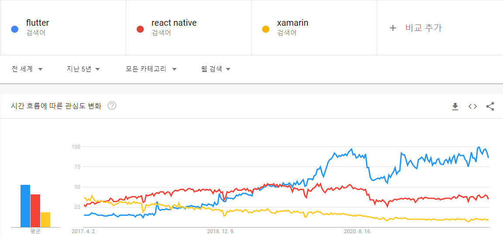

 
> 플러터(flutter)는 구글이 출시한 프레임워크로 크로스 플랫폼(cross-platform)을 위한
>
> GUI 애플리케이션을 만들기 위한 오픈 소스이다.

[Flutter 홈페이지](https://flutter.dev/)
 
 

크로스 플랫폼은 여러 플랫폼에서 동작한다는 것을 의미하며,

플러터로 프로그래밍을 하여 안드로이드(android), 아이폰(ios) , 웹페이지(web) 환경에서

동작하는 프로그램을 만들 수가 있다.

 

 
 
현재 데스크톱 환경 지원도 준비 중에 있으며,

이는 우리가 사용하는 거의 대부분의 환경에서

실행할 수 있는 프로그램을 만들 수 있다는 것을 의미한다.

 

 
 
페이스북에서 만든 React-Native가 가장 대중적이고 많이 알려져있어

크로스 플랫폼으로 RN을 선호해 왔으나

현재는 플러터가 빠른속도로 성장하고 있는 것으로 보인다.

플러터는 모바일, 웹 뿐만 아니라 데스크톱, Linux 환경의 어플리케이션을 만들 수 있다.
 
 
 
나온지 얼마 되지 않아 안정성, 라이브러리 등의 문제가 제기되어 왔으나

국내에서도 엔터프라이즈급 앱을 flutter로 개발 하는 등 다양한 시도들이 이루어지고 있다.

[Flutter로 만든 네이버 지식in 앱](https://d2.naver.com/helloworld/3384599)

 
구글에서 적극적으로 진행중인 프로젝트여서 그런지

버전 업그레이드도 활발하게 이루어지고 있고

개발문서도 잘 정리되어 있어 초보 개발자가 접근하기에도 그리 어렵지 않다.

 
flutter는 Dart 언어를 사용하는데 Java나 kotlin과 문법 구조가 비슷하여

해당 언어 사용자라면 좀더 편하게 접근이 가능하다.

 

 

 