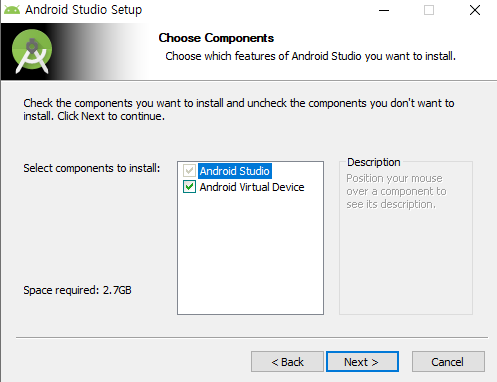

 
플러터가 크로스 플랫폼 프레임워크인 만큼

iOS 환경(아이폰)에서의 구동을 확인하기 위한 테스트가 필요한데 이를 위해선 macOS가 필요하다.

iOS 환경 디버깅을 위해 macOS에서 구동할 수 있는 개발툴인 XCode가 필요하기 때문이다.

 
mac 환경이 준비되지 않았더라도 windows 환경에서 개발을 진행한 후
.
클라우드 자동 배포 툴 등을 활용하면

디버깅은 아니더라도 iOS 앱 배포를 진행할 수는 있다

 
 
같은 코드로 동작하므로 먼저 안드로이드 환경에서 테스트를 진행한 후

추후 iOS 환경 테스트를 별도로 진행이 가능하다.

먼저 windows 환경에서 flutter 개발환경을 셋팅해본다.

flutter 공식 페이지로 접속해본다.

 
[Flutter 홈페이지](https://flutter.dev/)

 

 
 

 
Windows를 클릭하면 설치하는 과정이 잘 설명되어 있다. 하나씩 따라해보자.
 
 

파일명이 쓰여진 파란색 버튼을 클릭하여

파일을 다운로드한 후 압축을 해제한다.

접근권한을 요구하는 디렉토리에는 설치하지 말라고 경고하고 있다.

path를 설정할 것이기 때문에 적당한 곳에 압축해제한 디렉토리를 옮겨주고 

해당 경로를 환경변수에 추가해주면 설치가 끝난다.

 
이후 안드로이드 앱을 디버깅하기 위해 안드로이드 환경 셋팅이 필요하다.

 
[안드로이드 스튜디오](https://developer.android.com/studio)

 
안드로이드 스튜디오를 다운받고 설치를 진행한다.

안드로이드 스튜디오는 안드로이드를 개발하기 위한 개발툴이다.

이를 개발툴 로서 사용해도 되지만 flutter 외 다른 언어, 프로젝트에 더 범용적으로 사용할 수 있는

Visual Studio Code를 사용할 것이다.

 

 
안드로이드 가상머신을 반드시 설치한다.

테스트용 안드로이드 폰이 있다면 USB 연결 후 바로 폰에서 앱을 테스트 해볼 수 있으나

테스트용 기기가 없다면 에뮬레이터를 실행하여 테스트를 진행할 수 있다.

 

 
안드로이드 스튜디오를 실행 후 AVD Manager를 실행한다.

 

Create Virtual Device를 클릭 후 적당한 에뮬레이터를 생성한다.

 
여러 규격의 에뮬레이터를 생성할 수 있으나

Galaxy S20, iphone12 등 특정한 모델의 정확한 규격을 생성하기는 다소 어려우며,

별도의 해당 모델 파일을 다운로드하여 적용해야 한다.

하지만 핸드폰 모델들의 규격이 모두 제각각이며

이를 모두 테스트하고 적용하기에는 불가능에 가깝다.

따라서 기준 사이즈를 정하고 앱 내부에서

기기의 화면 크기에 따라 컨텐츠의 크기를 변환하는 방법으로

해상도 차이에 따른 출력을 대응할 수 있다.

 
에뮬레이터를 기준사이즈로 가장 기본이 되는 360 x 640 해상도로 생성하였다.

이후 개발툴로 사용할 Visual Studio Code(VsCode)를 설치한다.

 
[Visual Studio Code](https://code.visualstudio.com/)

