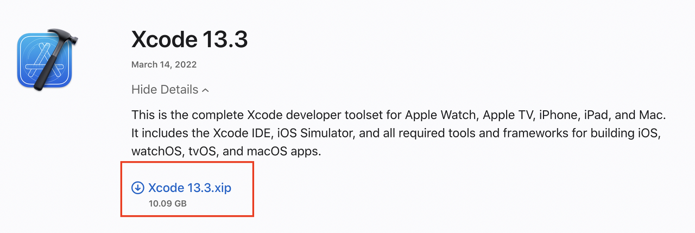
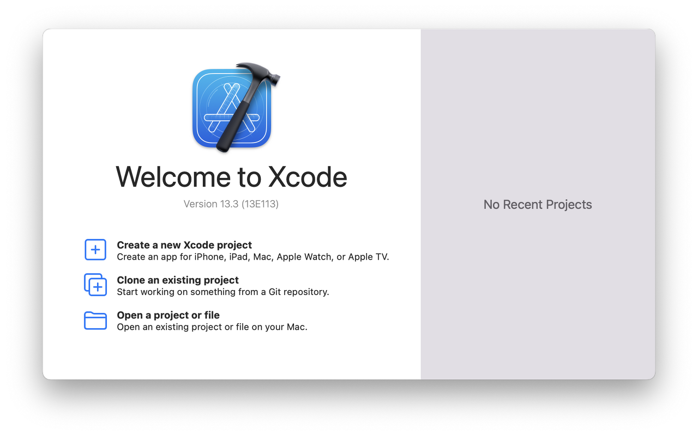

<br/>
> macOS환경에서 flutter를 개발하기 위한 개발환경 셋팅에 관한 글

<br/>
## 1. Xcode 설치

<br/>
iOS 디버깅을 위해 먼저 Xcode를 설치한다.

실제 개발툴은 vsCode를 사용할 것이지만 시뮬레이터 사용 및 디버깅을 위해선 반드시 설치해야 한다.

App Store에서 앱을 설치하거나 

<br/>
[](https://developer.apple.com/kr/xcode/)

<br/>
애플 공식 홈에서 최신버전을 다운 받아 설치한다.

<br/>



App Store 설치의 경우 속도가 매우 안나온다.

앱 리뷰를 보면 온갖 절규들이 올라와 있는 것을 확인할 수 있다.

잠에 들기 전 설치를 진행하거나 다운로드 후 설치하는 방법을 선택하자.

<br/>


설치가 완료되면 위와 같은 화면을 확인 할 수 있다.

아래의 명령어를 실행하여 설정을 완료한다.

```shell
sudo xcode-select --switch /Applications/Xcode.app/Contents/Developer
```
<br/>
## 2. git 설치

git은 버전 관리 시스템으로 개발에 필수적인 요소는 아니지만

소스를 저장하고 관리하기 위해서 가장 많이 사용하는 시스템이다.

따라서 git 사용법을 숙지해야 소스 관리를 용이하게 할 수 있다. 어찌보면 필수에 가깝다.
 
<br/>
git을 설치하기 위해선 macOS 패키지 관리자용 Homebrew가 필요하다.

<br/>
[Homebrew](https://brew.sh/index_ko)

<br/>
주소는 해당 사이트에서 확인이 가능하다.

터미널에서 해당 명령어를 실행한다.

```shell
/bin/bash -c "$(curl -fsSL https://raw.githubusercontent.com/Homebrew/install/HEAD/install.sh)"
```

<br/>
설치 완료 후 해당 메시지가 표기 되어 별도로 두가지 명령어를 실행했다.

```shell
==> Next steps:
- Run these two commands in your terminal to add Homebrew to your PATH:
    echo 'eval "$(/opt/homebrew/bin/brew shellenv)"' >> /Users/hoon/.zprofile
    eval "$(/opt/homebrew/bin/brew shellenv)"
```

<br/>
이제 homebrew를 이용하여 다음과 같이 brew 명령어로 git을 설치하는 명령어를 실행한다.

```shell
brew install git
```

<br/>
설치가 완료되면 다음 명령어를 실행하여 잘 설치가 되었는지 확인한다.

```shell
git --version
```