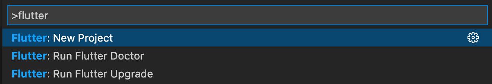
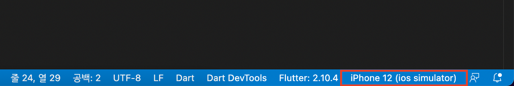
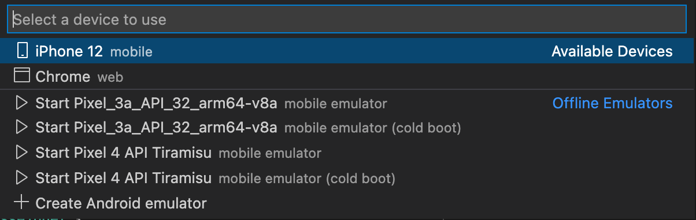
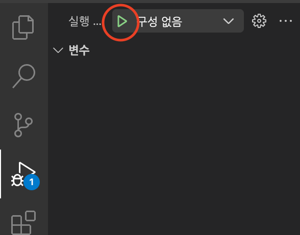
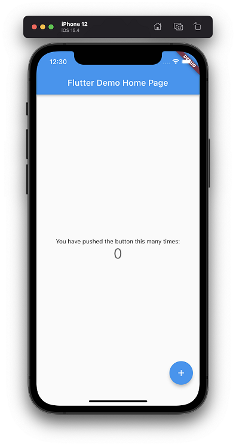
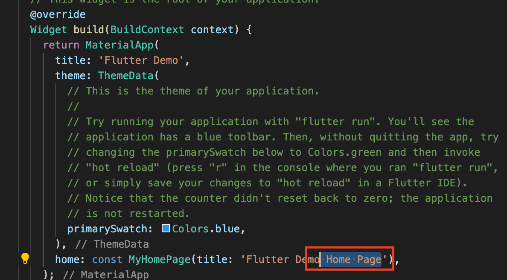

 
> 샘플 코드가 어떻게 구성되어 있는지 살펴보자

 

 

 
보기 -> 명령 팔레트 메뉴에서 flutter를 입력,

New Project를 선택하고 Application을 선택한다.

적당한 디렉토리와 프로젝트 명을 입력하면 샘플 코드가 생성된다.

 
이후 하단부의 해당 부분을 클릭하면

 
앱의 구동 방식을 선택할 수 있다.

 
구동 방식을 선택한 후 F5 를 누르거나

다음과 같이 실행 및 디버그에서 재생 버튼을 클릭하여 앱을 실행한다.

 
초기 구동은 앱을 빌드하는데 시간이 좀 걸린다.

앱이 구동되면 다음과 같은 샘플 앱이 실행된다.

 

 
 
앱을 구동한 상태에서 다음과 같이

프로젝트의 lib > main.dart 파일의 Home Page 부분을 삭제하고 

Ctrl(⌘) + S 버튼을 눌러 저장을 해보자

 

구동된 앱에서 변경사항이 즉각적으로 반영된다.

 

이것이 flutter의 'Hot reload' 기능이다.

메인함수나 초기화를 실행하지 않고 변경된 코드로 위젯트리를 재빌드 할 뿐이므로

앱을 재구동하는 것에 비해 속도가 훨씬 더 빠르다.

이로써 개발할 때 수정사항을 빠르게 확인하여 디버깅 시간을 매우 단축시킬 수 있다.

이제 샘플 코드를 분석해보자

 