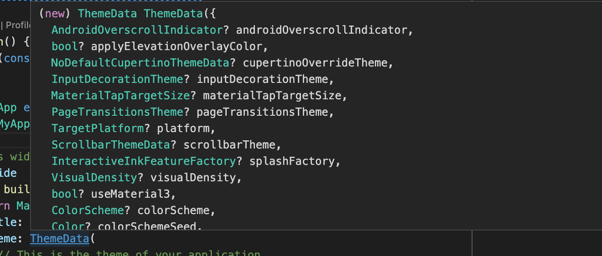

<br/>
> 간단한 샘플 코드로 앱을 실행해보고 분석해보자


```dart
import 'package:flutter/material.dart';
```

<br/>
*import* 문으로 material.dart 파일을 추가하고 있다.

material.dart은 material 위젯에 관한 패키지로

material은 디자인 방식 중 하나인데 안드로이드 폰에 범용적으로 사용되는 디자인이다.

[Material Design](https://m2.material.io/design)

비슷한 형태로 cupertino 디자인이 있는데  애플의 mac, 아이폰 등에서 사용되고 있다.

마찬가지로 cupertino.dart 파일을 추가하면 이 디자인을 활용할 수 있다.

<br/>
```dart
void main() {
  runApp(const MyApp());
}
```

앱을 구동하면 메인 함수가 실행 된다.

메인 함수에서 runApp 함수로 MyApp이라는 App을 구동하고 있다. 

MyApp을 살펴보자.

<br/>
 ```dart
class MyApp extends StatelessWidget {
  const MyApp({Key? key}) : super(key: key);
  
  @override
  Widget build(BuildContext context) {
    return MaterialApp(
      title: 'Flutter Demo',
      theme: ThemeData(
        primarySwatch: Colors.blue,
      ),
      home: const MyHomePage(title: 'Flutter Demo'),
    );
  }
}
```
*StatelessWidget* 클래스를 상속받는 클래스이다.

StatelessWidget은 말 그대로 상태가 없는 위젯이다. (물론 상태가 있는 위젯도 있다.)

build 함수로 *MaterialApp*이라는 Widget을 빌드하고 있다.

이 위젯은 title, theme, home이라는 속성을 가지고 있다.

<br/>
*title*에서 앱의 제목이 설정되어 있고

(실질적으로 앱의 이름은 프로젝트 패키지의 이름을 택하므로 폰에서 최근 사용한 앱 등의 정보를 표기할 때 활용된다.)

<br/>
*theme*에서는 테마 데이터가 추가되어 있는데 primarySwatch라는 속성을 통해 테마 색상이 설정되어 있다.

색상이 필요한 위젯에 색상을 따로 설정하지 않을 경우 해당 테마 색상으로 기본적으로 적용시킨다.

<br/>
*home*에는 해당 앱 실행 시 처음으로 표기할 위젯을 설정하는데 title 속성으로 문자열을 전달하고 있다.

이 문자열이 화면에 보여지는 상단의 제목에 보여지는 것이다.

<br/>
인자로 전달된 *context*에는 위젯트리에 관한 정보가 담겨있다.

(위젯에서 다른 위젯으로 이동했을 시 back 버튼 등을 통해 이전 위젯으로 이동할때 이 context 정보가 필요한 것이다.)

<br/>
ThemeData, MaterialApp과 같은 클래스에 마우스를 갖다대면 해당 클래스의 정보를 확인할 수 있다.

<br/>



```dart
class MyHomePage extends StatefulWidget {
  const MyHomePage({Key? key, required this.title}) : super(key: key);

  final String title;

  @override
  State<MyHomePage> createState() => _MyHomePageState();
}
```
<br/>
홈에서 실행되는 *MyHomePage*는 상태(state)를 가지는 *StatefulWidget* 이다.

*title* 변수를 가지고 있고 *createState()* 함수를 통해 *_MyHomePageState*라는 상태를 리턴하고 있다.

해당 위젯이 빌드되면서 상태를 가지는 위젯이 빌드 되는 것이다.

<br/>
```dart
class _MyHomePageState extends State<MyHomePage> {
  int _counter = 0;

  void _incrementCounter() {
    setState(() {
      _counter++;
    });
  }

  @override
  Widget build(BuildContext context) {
    return Scaffold(
      appBar: AppBar(
        title: Text(widget.title),
      ),
      body: Center(
        child: Column(

          mainAxisAlignment: MainAxisAlignment.center,
          children: <Widget>[
            const Text(
              'You have pushed the button this many times:',
            ),
            Text(
              '$_counter',
              style: Theme.of(context).textTheme.headline4,
            ),
          ],
        ),
      ),
      floatingActionButton: FloatingActionButton(
        onPressed: _incrementCounter,
        tooltip: 'Increment',
        child: const Icon(Icons.add),
    );
  }
}
```

_MyHomePageState가 실질적으로 위젯의 현재 상태를 그려주고 있다.

*Scaffold*를 빌드하고 있는데 material 디자인의 일반적인 앱의 템플릿이라고 생각하면 된다.

<br/>
appBar 속성에 *AppBar*를 전달하는데 title 속성에 *Text(widget.title)*이 전달되고 있다.

widget.title에서 widget은 현재 상태의 위젯 *MyHomePage*이며

MyHomePage 위젯의 변수였던 title을 Text위젯으로 만들고 있는 것이다.

이처럼 flutter에서 화면에 보여지는 모든 것은 Widget 이다.

간단한 텍스트 조차도 화면에 그려주기 위해선 Widget으로 감싸주어야 한다.

<br/>
*floatingActionButton*에는 우측 하단에 떠있는 버튼을 정의해주고 있다.

onPressed 속성에 _incrementCounter가 있는데

setState() 함수를 실행하여 _counter++로 카운터 변수를 증가시키고 있다.

즉 해당 버튼을 클릭하면 counter 변수가 증가하며 setState() 함수를 통해 상태를 변경하는 것이다.

child 속성으로 버튼 내부의 위젯을 정의하는데 Icon 위젯을 생성하여 리턴하고 있다.

<br/>
*body* 속성에는 말 그대로 화면의 몸체에 보여줄 위젯을 정의해주고 있다.

*Center* 위젯으로 중앙 부분에 child인 *Column* 위젯을 리턴하는데

Column 위젯은 자식(children)들을  세로로 배치한다.

Row 위젯으로 자식들을 가로로 배치할 수 있는데 이런 레이아웃에 관한 자세한 내용은 다시 다룰 것이다.

<br/>
두번째 텍스트에서 $_counter 를 출력하고 있는데

버튼을 클릭하면 counter 변수가 증가하고 상태가 변경되므로 숫자가 변하는 것이다.

*Text* 위젯의 sytle 속성을 통해 텍스트의 스타일(크기, 글씨체, 색상 등) 을 정의할 수 있는데

내부적으로 정의된 텍스트 테마를 이용하여 적용시키고 있다.

<br/>

---

<br/>
이렇게 state를 관리하여 각각의 위젯의 상태를 변경하는 것을 상태관리라 하며

플러터는 모든 것이 위젯이므로 이 상태관리를 어떻게 하는지가 핵심이다.