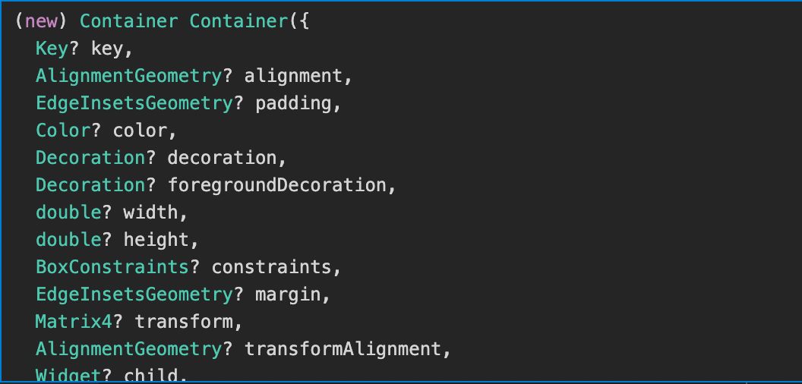

<br/>
> 이제 위젯들을 어떻게 배치할 것인지에 대해 고민을 해보자 - 레이아웃

<br/>
샘플 코드에서 화면에 보이는 모든 것은 위젯이라는 것을 알게 되었다.

이런 위젯 하나하나를 만들고

위젯에 위젯을 얹어 레이아웃을 구성하고

build해주는 것이 flutter의 기본이다.

<br/>
## 1. Column 위젯


이전 샘플코드에서 어떠한 위젯들을 세로로 나열하려면 Column 위젯을 사용한다는 것을 알았다.

샘플 코드에서 body: 를 다음과 같이 바꾸고 가지고 놀아 본다.

<br/>
```dart
Column(
	mainAxisAlignment: MainAxisAlignment.center,		/// (1 - 메인 정렬)
    	crossAxisAlignment: CrossAxisAlignment.center,		/// (2 - 수직 정렬)
	children: <Widget>[
    	Text('1'),
        Text('2'),
        Text('3')
    ],
)
```
<br/>
mainAxisAlignment는 메인이 되는 정렬로 Column은 세로 배열이니 세로열의 정렬을 뜻한다.

mainAxisAlignment: 에서 MainAxisAlignment. 를 타이핑하고 자동완성 되는 property를 확인 해보자

<br/>


각각의 속성 spaceBetween(양쪽 분할), spaceAround(균등 분할)으로 변경 후 위젯의 변화를 살펴보자.

<br/>


<br/>
crossAxisAlignment는 수직 정렬로 Column은 세로 배열이니 수직인 가로열의 정렬을 뜻한다.

crossAxisAlignment: 에서 CrossAxisAlignment. 를 타이핑하고 자동완성 되는 property를 확인 해보자

<br/>


<br/>
그런데 이상하다...

CrossAxisAlignment.center 이면 중앙으로 정렬이 되어야 하는데 왼쪽에 붙어 있다.

왜 그럴까?
 
<br/>
Column은 단순히 위젯들을 세로로 정렬하는 것에 지나지 않는다.

크기가 따로 지정되지 않았기 때문에 내부의 child,

즉 텍스트 만큼의 크기만 할당하여 그것을 나열한 것 뿐이다.

다음은 Column이 차지하고 있는 영역이다.

<br/>


<br/>
위젯들의 크기만큼만 할당된 상태에서 세로로 정렬하였고, 중앙으로 가로 정렬하였다.

빨간 영역에서 중앙 정렬하였기 때문에 정렬이 되지 않은 것처럼 보였다.

따라서 중앙 정렬을 하기 위해서 Column의 크기를 지정해주어야 한다.

 
<br/>
Column의 속성을 확인해보자.

<br/>

 
<br/>
Column은 크기를 지정해주는 속성이 따로 없는 것처럼 보인다. 어찌 해야할까?

이때 사용하는 위젯이 Container 위젯이다.

<br/>


<br/>
컨테이너는 말그대로 어떠한 위젯을 감싸주고 그것을 꾸며주는 역할을 하는 위젯으로, 굉장히 자주 사용되는 위젯이다.

속성들을 살펴봐도 크기, 정렬, 색상 등 다양한 속성들을 활용할 수 있는 것으로 보인다.

컨테이너의 크기를 지정해주고 child로 Column을 설정하면

컨테이너 만큼의 크기를 보장 받는 Column 위젯이 되는 것이다.

Column을 Container로 감싸본다.

```dart
Container(
	color: Colors.red,
    width: double.infinity,
    child: Column(
        mainAxisAlignment: MainAxisAlignment.center,		/// (1 - 메인 정렬)
            crossAxisAlignment: CrossAxisAlignment.center,		/// (2 - 수직 정렬)
        children: <Widget>[
            Text('1'),
            Text('2'),
            Text('3')
        ],
    )
)
```

<br/>
color 속성을 Colors.red로 지정하여 빨간 컨테이너를 만들고

width 속성을 double.infinity로 지정했다.

double.infinity는 부모 위젯의 크기만큼,

즉 할당할 수 있는 최대의 크기만큼의 너비를 지정한다.

<br/>


<br/>
컨테이너가 너비를 모두 차지하게 되면서 정렬이 제대로 되고 있는 것을 확인할 수 있다.

정렬은 해결이 되었는데... Column 위젯에서 세로로 위젯들이 무수히 나열되면 어떨까?

<br/>


<br/>
Column은 높이를 할당 가능한 최대로 잡은 후 세로 배열을 하게 되는데

body의 child인 해당 Column은 body영역의 높이 만큼만 높이가 할당 되어서

해당 높이를 벗어나는 위젯이 생기자 위와 같이 overflow가 발생하였다.

그럼 위젯을 더 많이 표기하기 위해선 어떻게 해야할까?

 
<br/>
스크롤이나 비슷한 역할의 위젯등을 활용하여 모든 위젯을 표현할 수 있도록 보장해주면 된다.

예를들어 Column대신 ListView를 사용해보자.

```dart
Container(
	color: Colors.red,
    child: ListView(
    children: <Widget>[
    Text('1'),
    Text('2'),
    Text('3'),
    .
    .
    .
    .
   ]
  )
)
```

<br/>


ListView는 Column과 다르게 children 요소로 list를 받아 해당 요소들을 표기해주고

크기를 벗어나 화면에 표시 되지 않는 것들은 스크롤을 통해 확인할 수 있다.


<br/>
이처럼 화면 내에 정해진 개수의 세로, 가로 위젯들을 표현할 때에는 Column, Row

정해지지 않은, List 등의 데이터로 위젯들을 표현하여 스크롤이 필요할 때에는 ListView를 활용해야 한다.

(ListView의 가로 위젯은 별도로 존재하지 않고 scrollDirection 속성을 Axis.horizontal 로 정의하면 된다)

<br/>
## 2. Row 위젯
<br/>
자 Column 위젯의 개념을 익혔으면 Row 위젯은 동일한 개념으로 다룰 수 있다.

여러 속성들을 테스트 해보고 Row 위젯으로 텍스트들을 배치해보자.

Column은 세로(열), Row는 가로(행) 그 뿐이다.

mainAxisAlignment 과 crossAxisAlignment는 반대로 동작한다.


 