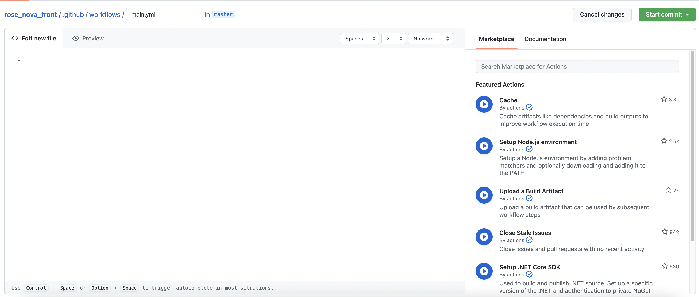
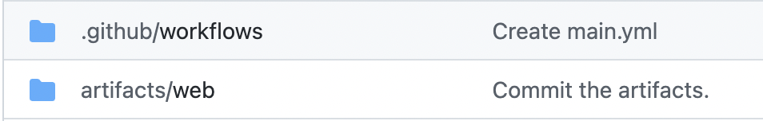
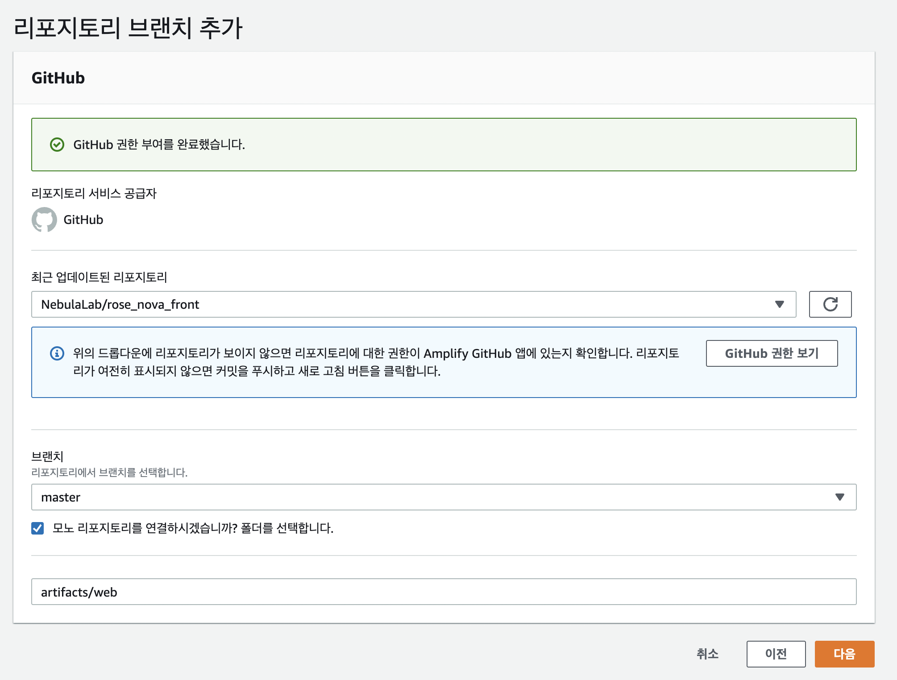
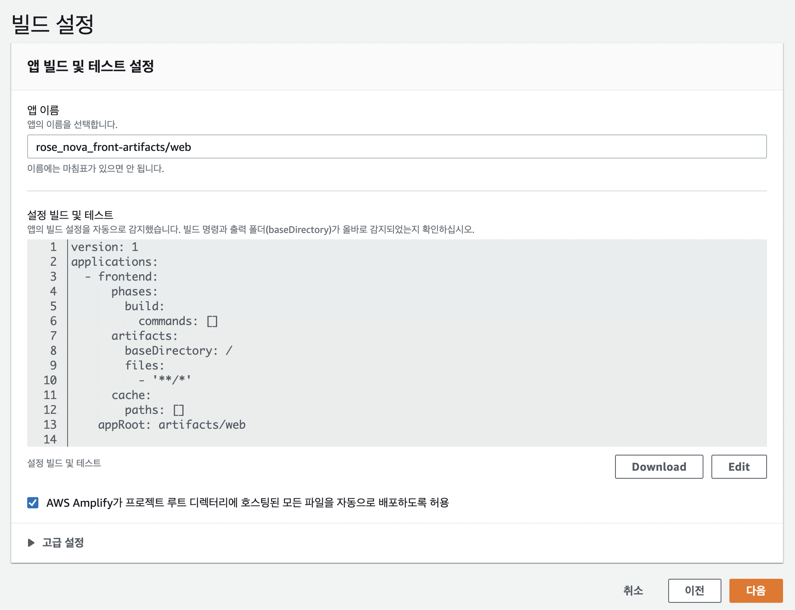
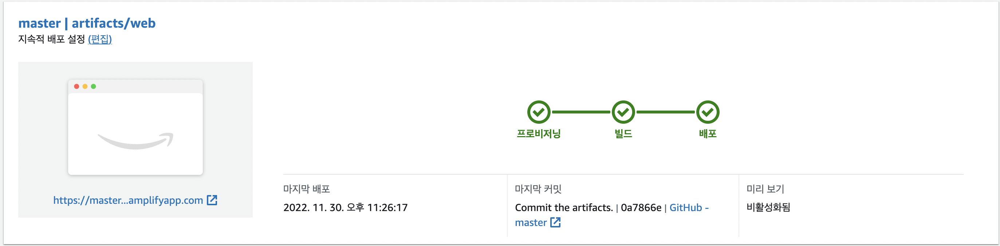

<br/>
> flutter 코드를 빌드하고 배포 하는 과정을 aws amplify로 자동화 해본다 (Flutter + GitHub + AWS amplify)

<br/>
## 1. CI/CD 의 중요성
코드를 작성하고 로컬 환경에서 테스트를 해본 후 다른 사람에게 보여주거나 팀원과 공유, 배포를 하기 위해서는

여러가지 과정을 거쳐야 한다. 빌드부터 호스팅 서버 업로드, git 관리 까지..

이러한 것은 번거로운 '과정'으로 인식되어 개발이 진행 되었음에도

배포를 미뤄 한번에 처리하려고 하는 등의 습관으로 이어져 배포 환경은 지속적으로 업데이트 되지 않는다.

<br/>
이러한 문제를 해결하기 위해 
<br/>
CI(지속적 통합) - 코드 통합, 테스트 및 빌드

CD(지속적 제공) - 배포 자동화
<br/>
방식으로 파이프라인을 구축하여 개발자가 개발에 집중할 수 있는 환경을 만들어 주는것이 중요해지고 있다.


<br/>
## 2. GitHub 의 CI 구축

Github에서 CI 파이프라인을 구축해본다.

Github repository의 ACTION 탭으로 이동한다.

*set up a workflow yourself* 나 *new workflow*를 클릭하여 workflow를 생성한다.


<br/>
위와 같이 workflow를 추가할 수 있는 페이지로 이동되며 오른쪽 탭에서

workflow 생성에 대한 가이드를 확인할 수 있다.


다음과 같은 스크립트를 작성한다.

```yml
name: On Website Deploy
"on":
  push:
    branches:
      - "master"
jobs:
  build_and_deploy_web:
    name: Build & Deploy Flutter to Web
    runs-on: ubuntu-latest

    steps:
      - uses: actions/checkout@v2

      - uses: subosito/flutter-action@v2
        with:
          channel: "stable"

      - name: 🌍 Enable Web
        run: flutter config --enable-web 

      - name: 📦 Get packages
        run: flutter pub get

      - name: 🏭 Build Web Application
        run: flutter build web --release --web-renderer html
        
      - name: Make copy of artifacts
        run: |
          chmod u+x "${GITHUB_WORKSPACE}/createandcopytofolder.sh"
          bash "${GITHUB_WORKSPACE}/createandcopytofolder.sh"

      - uses: stefanzweifel/git-auto-commit-action@v4
        with:
          commit_message: Commit the artifacts.

```
스크립트를 보면 *master* branch에 push가 되면 *on* (실행) 되며 아래의 스크립트를 실행하여

환경설정 및 빌드, 파일 이동 및 commit이 이루어지는 것을 확인할 수 있다.

오른쪽의 start commit을 클릭하면 스크립트가 커밋 되고, 설정된 대로 master에 push가 되므로 스크립트가 실행, build가 실패 한다.

명시된 스크립트가 필요하기 때문이다. 

<br/>
git repository에 *createandcopytofolder.sh 파일을 추가* 한다.

```shell
[[ -d artifacts ]] && rm -r artifacts
mkdir artifacts
cp -R build/web artifacts
```

<br/>
파일이 push되면 역시 스크립트가 실행되고 이번에는 빌드가 진행되어 다음과 같이 디렉토리가 생성된다.
<br/>


이제 master branch는 코드를 통합하여 빌드까지 진행되는 파이프라인이 구축되었다.


<br/>
## 3. AWS amplify로의 CD 구축

이제 CI 파이프라인을 CD 파이프라인으로 연결시켜 보자

AWS management console에서 AWS Amplify 서비스로 이동한다.

*Host your Web app*을 클릭하여 새로운 앱을 생성하고 GitHub를 연동하면

다음과 같은 화면이 나온다.


repository와 branch를 선택하고 artifact의 경로를 설정한다.

<br/>


이후엔 amplify가 repository의 build 설정을 자동으로 감지하여 배포환경을 설정한다.

<br/>


이후 amplify가 빌드, 배포를 수행하며 완료 후 왼쪽 하단의 링크를 통해 배포 결과물을 확인할 수 있다.

amplify를 활용하니 간단하게 CD 파이프라인이 구축되었다.


이제 master branch에 소스를 push하면 몇분 뒤 배포된 결과물을 확인할 수 있는 환경이 되었다.