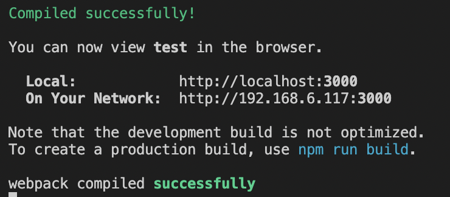

<br/>
> react를 설치하고 실행하는 과정을 살펴보자

<br/>
## 1. node.js 설치하기
[node.js 다운로드](https://nodejs.org/ko/download/)

에서 OS에 맞는 node.js 설치 파일을 다운 받고 설치를 진행한다.

<br/>
대부분의 경우 안정화 버전인 LTS 버전이 추천된다.

설치 후 터미널에서

```shell
node -v
```

명령어를 통해 설치 버전을 확인한다.

<br/>
## 2. npm 설치하기

npm은 node.js의 패키지 관리자 이다.

node.js 가 설치되면 npm 역시 설치된다.

```shell
npm -v
```

<br/>
## 3. npx 설치하기

npx는 npm과 같은 패키지 관리자이며 새로운 것이 아닌 npm 5.2버전부터 새로 추가된 도구이므로

npm 5.2버전 이상이 설치되었다면 별도의 설치 없이도 사용가능하다.

 
<br/>
패키지 설치시 일반적으로 모든 프로젝트에서 사용될 수 있도록 " -g " 옵션을 통해 글로벌 모듈로 설치하게 되는데

이렇게 설치된 모듈은 자동으로 모듈 버전이 추적되지 않아 관리가 어렵고 버전 업데이트를 확인해줘야 하는 번거로움이 있다.

 
<br/>
그렇다고 각각의 프로젝트마다 로컬로 패키지를 관리하기 위해서는

매 설치시 직접적으로 path를 지정하거나 직접 설치를 진행해야하는 등의 번거로움이 있다.

 
<br/>
npx는 이러한 문제점들에 대한 해결책을 주며

해당 명령어를 통해 최신 버전의 패키지를 설치하여 실행하고 실행된 후 해당 패키지를 제거한다.

```shell
npx -v
```

<br/>
## 4. React 데모 프로젝트 생성하기

간단한 데모 프로젝트를 생성하기 위해 터미널에서 다음의 명령어를 실행한다.


```shell
npx create-react-app '프로젝트 명'
```

<br/>
위에서 설명했듯이 create-react-app 패키지를 설치함과 동시에 실행되고 이후 패키지는 제거된다.

아래의 명령어를 통해 해당 패키지가 제거 됐음을 확인해본다.


```shell
which create-react-app
```
<br/>
직접적으로 설치하는 대신 npx를 통해 간단한 명령어로 설치가 가능한 것이다.

생성된 프로젝트 디렉토리로 이동하여 다음의 명령어를 실행하면 자동으로 웹페이지가 실행된다.

```shell
npm start
```
<br/>
<br/>


접속 가능한 주소, 동일한 네트워크에서의 주소도 친절하게 안내해준다.